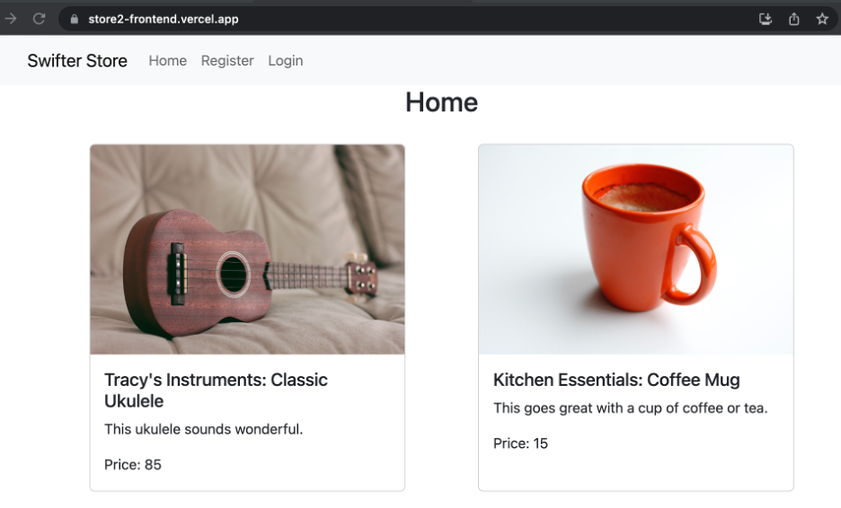
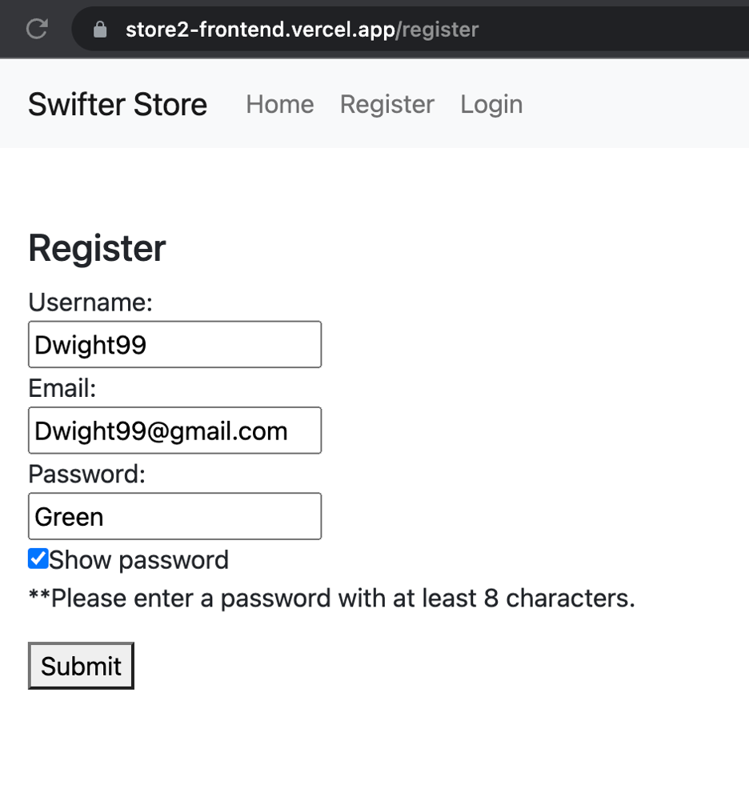
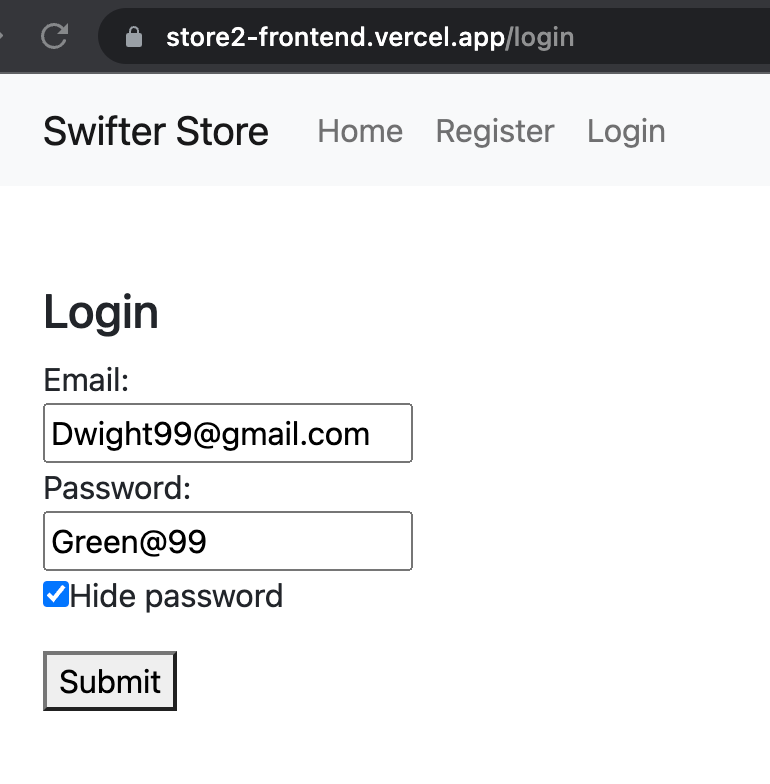
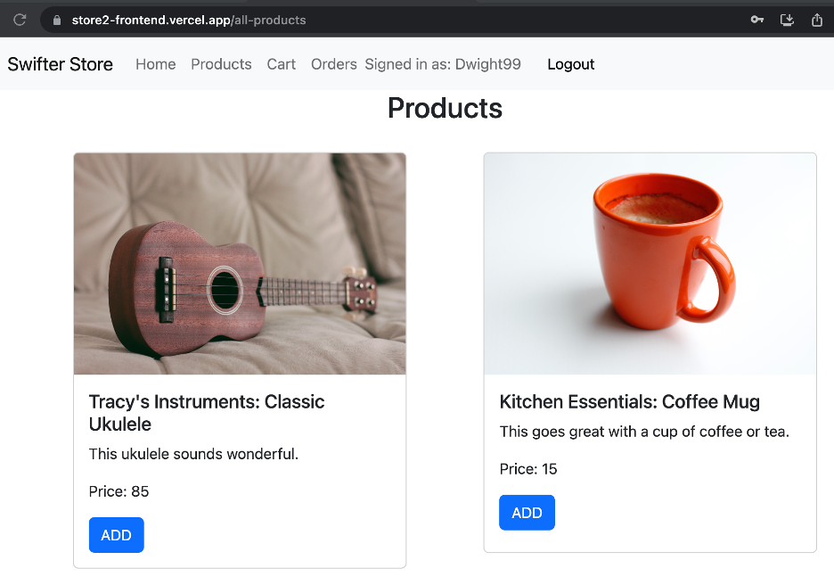
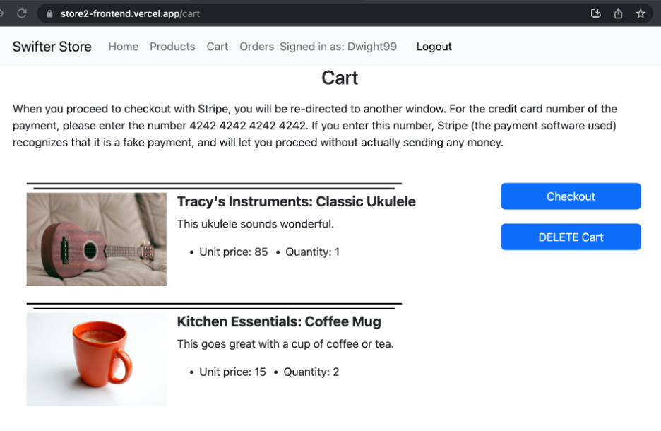
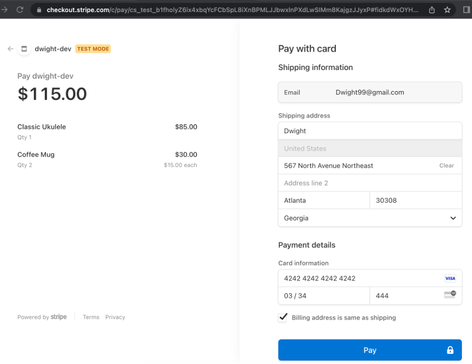
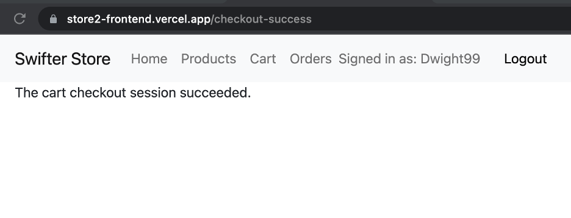
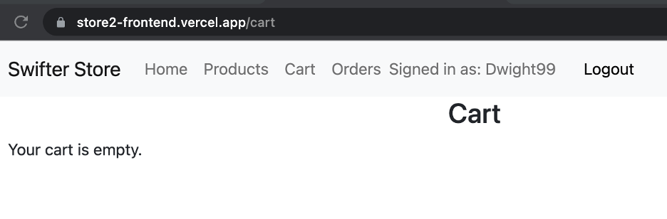
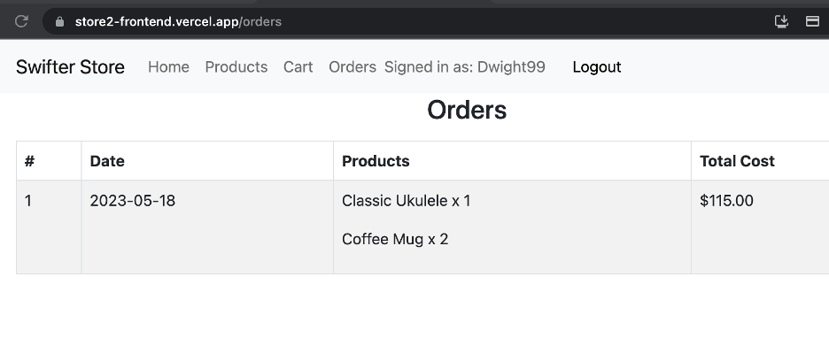

## overview 
- This site was developed as a portfolio project by Dwight Lindquist. It is the second iteration of his ecommerce store app, this time built with React, Laravel, and SQL. 
- Visitors can create user accounts then browse for various fake products. They can then add products to a cart, proceed to a checkout handled by Stripe, then see records of past orders from their account. The user is advised to use the credit card number "4242 4242 4242 4242" in order to successfully proceed with a fake payment via Stripe. 

## deployed url
- https://store2-frontend.vercel.app/

## backend repository on GitHub 
- https://github.com/dlindqu3/store2-backend

## walkthrough

## product image sources
1. Bike image: photo by Robert Bye on Unsplash. 
2. Coffee mug image: photo by Merve Sehirli Nasir on Unsplash. 
3. Drums image: photo by David Martin on Unsplash.
4. Ukulele image: Photo by Joints Creative on Unsplash.

## run locally 
- npm start 
- npm test 

## testing notes 
- using mock service workers mimics calls to an API without actually making those requests
- So it is cheaper, faster, and more reliable than calling your actual APIs during testing

## citations 
1. The Net Ninja, "MERN Stack Tutorial #8 - Making a React App", [link](https://www.youtube.com/watch?v=bx4nk7kBS10&list=PL4cUxeGkcC9iJ_KkrkBZWZRHVwnzLIoUE&index=8)
2. "POST Requests with Axios", [link](https://masteringjs.io/tutorials/axios/post)
3. "Importing images from public folder in react", [link](https://stackoverflow.com/questions/71881492/importing-images-from-public-folder-in-react)
4. W.S. Toh, "2 Ways To Check If Value Exists In Javascript Object", [link](https://code-boxx.com/check-value-exists-in-object-javascript/)
5. Nick Scialli, "Why you can't set state multiple times in a row in React", [link](https://typeofnan.dev/why-you-cant-setstate-multiple-times-in-a-row/)
7. "Clearing localStorage in javascript?", [link](https://stackoverflow.com/questions/7667958/clearing-localstorage-in-javascript)
8. "How to trigger useEffects before render in React?", [link](https://stackoverflow.com/questions/63711013/how-to-trigger-useeffects-before-render-in-react)
9. The Net Ninja, "MERN Authentication Tutorial #16 - Protecting React Routes", [link](https://www.youtube.com/watch?v=to-V-LcsXUU)
10. ByteGrad, "Sticky Footer in React (Best Solution)" [link](https://www.youtube.com/watch?v=pggIVY5eOGM)
11. The Net Ninja, "React Testing Library Tutorial #12 - Finding Async Elements with FindBy" [link](https://www.youtube.com/watch?v=V2wWLM8VX5k)
12. TechCheck, "React Testing Library - Mock API Calls - Mock Service Worker (msw)" [link](https://www.youtube.com/watch?v=oMv2eAGWtZU)
13. Stack Overflow, "react-testing-library why is toBeInTheDocument() not a function" [link](https://stackoverflow.com/questions/56547215/react-testing-library-why-is-tobeinthedocument-not-a-function)
14. Stack Overflow, "react jest mock useNavigate()" [link](https://stackoverflow.com/questions/66284286/react-jest-mock-usenavigate)
